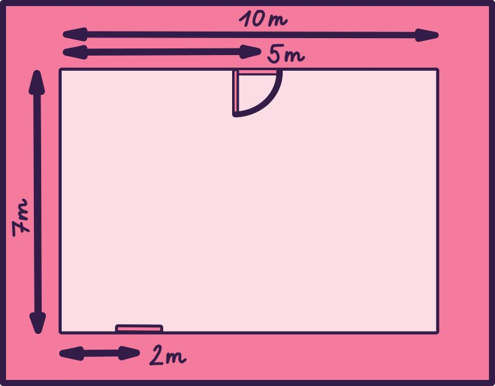

# Zadání
Ben pracuje na střední škole jako tělocvikář. Nedávno přišel za vedením se skvělým nápadem jak přimět žáky k pohybu: zamkne přední dveře. Žáci pak budou muset školu obejít a vejít zadním vchodem. Zajímalo by ho, kolik metrů navíc díky jeho plánu žáci ujdou.

Škola má půdorys obdélníku a její přední strana míří na jih. Její šířka (z východu na západ) je 𝑆 metrů a její délka (ze severu na jih) 𝐷 metrů. Přední dveře jsou umístěny na jižní stěně 𝑃 metrů na východ od jihozápadního rohu. Zadní dveře jsou umístěny na severní stěně 𝑍 metrů na východ od severozápadního rohu. Žáci přijdou jako obvykle k předním dveřím a až zjistí, že jsou zamčené, tak budovu obejdou a dojdou k zadním dveřím. Žáci jsou líní, takže školu chtějí obejít vždy nejkratší cestou. Určete, jestli je kratší školu obejít zleva (ze západní strany) nebo zprava (z východní strany), a spočítejte, jak dlouhá nejkratší cesta je.

## Tvar vstupu
Na prvním řádku vstupního souboru je číslo 𝑇, počet problémů, které musíte vyřešit.

Pro každý problém dostanete čísla 𝑆, 𝐷, 𝑃 a 𝑍, každé na vlastním řádku. Čísla 𝑆 a 𝐷 přestavují šířku a délku budovy v metrech. Čísla 𝑃 a 𝑍 představují vzdálenosti předního a zadního vchodu od západu budovy, také v metrech.

## Tvar výstupu
Pro každý problém vypište jediné číslo, a to nejkratší vzdálenost v metrech, kterou se dá budova obejít od předního vchodu k zadnímu.

## Lehká verze
1 ≤ 𝑇 ≤ 10  
1 ≤ 𝑆, 𝐷 ≤ 1 000  
0 ≤ 𝑃, 𝑍 ≤ 𝑆

## Těžká verze
1 ≤ 𝑇 ≤ 1 000  
1 ≤ 𝑆, 𝐷 ≤ 1 000 000  
0 ≤ 𝑃, 𝑍 ≤ 𝑆

## Ukázkový vstup
```
2
10
7
2
5
20
10
15
15
```

## Ukázkový výstup
```
14
20
```

## Vysvětlení ukázkového vstupu a výstupu
Situace v prvním problému je vyzobrazená tomto obrázku:.



Žákům se vyplatí budovu obejít západní stranou (zleva). Nejprve ujdou 2 metry k jihozápadnímu rohu, poté 7 metrů k severozápadnímu rohu a nakonec dalších 5 metrů k zadnímu vchodu.

V druhém problému se vyplatí více budovu obejít z východu (zprava). Žáci ujdou nejprve 5 metrů na východ, poté 10 metrů na sever a nakonec 5 metrů na západ.